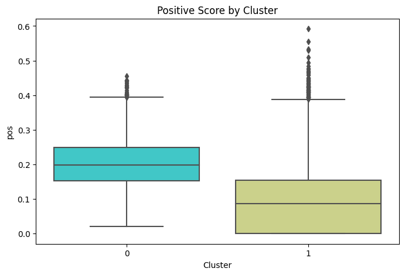

# What you should (and shouldn't) name your children

Every year there are numerous publications over the most popular baby names. But have you ever seen any publication covering the "flip side"? The worst names to give your child? The goal of this analysis will be to see if there is any relationship between a person's first name and how much they were liked (or disliked) at the time of death.   

### Importing Packages


```python
import requests
from bs4 import BeautifulSoup
import time
import seaborn as sns
import pandas as pd
import wordcloud
#from PIL import Image
from wordcloud import WordCloud
import matplotlib.pyplot as plt
import nltk
from nltk.corpus import stopwords
from nltk.stem import WordNetLemmatizer
import re
import numpy as np
from nltk.sentiment.vader import SentimentIntensityAnalyzer
from tqdm import tqdm
from sklearn.cluster import KMeans
from sklearn.feature_extraction.text import CountVectorizer, TfidfVectorizer
import csv


nltk.download('vader_lexicon')
nltk.download('stopwords')
nltk.download('wordnet')
```

    [nltk_data] Downloading package vader_lexicon to
    [nltk_data]     /Users/mitchfairweather/nltk_data...
    [nltk_data]   Package vader_lexicon is already up-to-date!
    [nltk_data] Downloading package stopwords to
    [nltk_data]     /Users/mitchfairweather/nltk_data...
    [nltk_data]   Package stopwords is already up-to-date!
    [nltk_data] Downloading package wordnet to
    [nltk_data]     /Users/mitchfairweather/nltk_data...
    [nltk_data]   Package wordnet is already up-to-date!


    True


### Functions used to scrape obituary data


```python
def obituaries(url):
    headers = {'user-agent': 'Mozilla/5.0 (Macintosh; Intel Mac OS X 13_4_1) AppleWebKit/605.1.15 (KHTML, like Gecko) Version/16.5 Safari/605.1.15'}
    r = requests.get(url, timeout = 120, headers = headers)
    r.close()
    soup = BeautifulSoup(r.content, "html.parser")
    obit_name = soup.find(class_ = "MuiTypography-root MuiTypography-h1 css-bpbdsz").get_text()
    obit_text = list(soup.find_all("p", class_ = "MuiTypography-root MuiTypography-body1 css-1yzfdrp css-9l3uo3"))
    for i in range(len(obit_text)):
        obit_text[i] = obit_text[i].get_text()
    obit_text = "".join(obit_text)
    time.sleep(.5)
    return obit_name, obit_text

    
```


```python
def get_obit_links(pages):
    obituary_links = []
    for page in tqdm(range(1, pages + 1)):
        try: 
            headers = {'user-agent': 'Mozilla/5.0 (Macintosh; Intel Mac OS X 13_4_1) AppleWebKit/605.1.15 (KHTML, like Gecko) Version/16.5 Safari/605.1.15'}
            url = "https://www.indystar.com/obituaries?page=" + str(page)
            r = requests.get(url, timeout = 120, headers = headers)
            r.close()
            soup = BeautifulSoup(r.content, "html.parser")
            links = soup.find_all("a", class_ = "link")
            for link in links:
                obituary_links.append("https://www.indystar.com" + link.get('href'))
            time.sleep(.5)
        except: 
            continue
            
    return obituary_links
            
        
```

### Scraping Obituary Data

Data for this analysis has been pulled the Indianapolis Star, the local publication serving Indianapolis, Indiana area. The oldest data published is from Dec 07, 2018. I have scraped all obituaries published in the Indy Start since that date. 


```python
obituary_links = get_obit_links(pages = 1370)
```

    100%|███████████████████████████████████████| 1370/1370 [15:55<00:00,  1.43it/s]


with open("/Users/mitchfairweather/Obituaries/IndyStarObituariesLinks.csv", 'w') as myfile:
    wr = csv.writer(myfile, quoting=csv.QUOTE_ALL)
    wr.writerows(obituary_links)


```python
obituary_names = []
obituary_texts = []
new_obit_links = []
bad_links = []
```


```python
for link in tqdm(obituary_links):
    for i in range(3): 
        try: 
            name, text = obituaries(str(link))
            obituary_names.append(name)
            obituary_texts.append(text)
            new_obit_links.append(link)
        except: 
            if i == 2: 
                bad_links.append(str(link))
                break 
            else: 
                continue
        else: 
            break
```

    100%|███████████████████████████████████| 27366/27366 [5:18:05<00:00,  1.43it/s]


```python
obituary_df = pd.DataFrame()
obituary_df["Names"] = obituary_names
obituary_df["Obituary"] = obituary_texts
obituary_df["Links"] = new_obit_links
```


```python
obituary_df.drop_duplicates(inplace = True)
obituary_df.reset_index(drop = True, inplace = True)
```

obituary_df.to_csv("/Users/mitchfairweather/Obituaries/IndyStarObituaries.csv")


```python
obituary_df.head()
```


<div>
<style scoped>
    .dataframe tbody tr th:only-of-type {
        vertical-align: middle;
    }

    .dataframe tbody tr th {
        vertical-align: top;
    }

    .dataframe thead th {
        text-align: right;
    }
</style>
<table border="1" class="dataframe">
  <thead>
    <tr style="text-align: right;">
      <th></th>
      <th>Names</th>
      <th>Obituary</th>
      <th>Links</th>
    </tr>
  </thead>
  <tbody>
    <tr>
      <th>0</th>
      <td>Lucia Y. Beck</td>
      <td>83, 09-Jul, Indiana Funeral Care, Greenwood Ch...</td>
      <td>https://www.indystar.com/obituaries/ins151192</td>
    </tr>
    <tr>
      <th>1</th>
      <td>James Cooke Jr.</td>
      <td>75, 11-Jul, Matthews Mortuary, Brownsburg.</td>
      <td>https://www.indystar.com/obituaries/ins151167</td>
    </tr>
    <tr>
      <th>2</th>
      <td>Mrs. Julia Marie (Haake) Curran</td>
      <td>Mrs. Julia Marie (Haake) Curran 78 of Brownsbu...</td>
      <td>https://www.indystar.com/obituaries/ins151191</td>
    </tr>
    <tr>
      <th>3</th>
      <td>Paul Davidson Jr.</td>
      <td>62, 10-Jul, Wilson St. Pierre Funeral Service ...</td>
      <td>https://www.indystar.com/obituaries/ins151149</td>
    </tr>
    <tr>
      <th>4</th>
      <td>Luis E. Fairfield</td>
      <td>21, 09-Jul, Lauck and Veldhof Funeral and Crem...</td>
      <td>https://www.indystar.com/obituaries/ins151158</td>
    </tr>
  </tbody>
</table>
</div>


```python
obituary_df.describe()
```


<div>
<style scoped>
    .dataframe tbody tr th:only-of-type {
        vertical-align: middle;
    }

    .dataframe tbody tr th {
        vertical-align: top;
    }

    .dataframe thead th {
        text-align: right;
    }
</style>
<table border="1" class="dataframe">
  <thead>
    <tr style="text-align: right;">
      <th></th>
      <th>Names</th>
      <th>Obituary</th>
      <th>Links</th>
    </tr>
  </thead>
  <tbody>
    <tr>
      <th>count</th>
      <td>27301</td>
      <td>27301</td>
      <td>27301</td>
    </tr>
    <tr>
      <th>unique</th>
      <td>26548</td>
      <td>24636</td>
      <td>27301</td>
    </tr>
    <tr>
      <th>top</th>
      <td>Greg Davis</td>
      <td>Cremation Society of Indiana</td>
      <td>https://www.indystar.com/obituaries/ins151192</td>
    </tr>
    <tr>
      <th>freq</th>
      <td>5</td>
      <td>298</td>
      <td>1</td>
    </tr>
  </tbody>
</table>
</div>


### Cleansing Data

The Names of each obituary contains various preceeding titles that we don't want to consider a "first name" including "Mr.", "Miss", etc. These are all removed as part of the creation of the "First Name" field. 


```python
obituary_df["First Name"] = obituary_df["Names"]

#Remove all text within parentheses and quotes which would indicate a nickname
first_name = []
for i in range(0, len(obituary_df)):
    name = re.sub(r'\([^)]*\)', '', obituary_df['First Name'][i])
    name = re.sub(r'\"[^)]*\"', '', obituary_df['First Name'][i])

    first_name.append(name)

obituary_df["First Name"] = first_name

obituary_df["First Name"] = obituary_df["First Name"].str.replace("Mr. ", '')
obituary_df["First Name"] = obituary_df["First Name"].str.replace("Mr ", '')
obituary_df["First Name"] = obituary_df["First Name"].str.replace("Mrs. ", '')
obituary_df["First Name"] = obituary_df["First Name"].str.replace("Mrs ", '')
obituary_df["First Name"] = obituary_df["First Name"].str.replace("Ms. ", '')
obituary_df["First Name"] = obituary_df["First Name"].str.replace("Ms ", '')
obituary_df["First Name"] = obituary_df["First Name"].str.replace("Miss. ", '')
obituary_df["First Name"] = obituary_df["First Name"].str.replace("Miss ", '')
obituary_df["First Name"] = obituary_df["First Name"].str.replace("Dr. ", '')
obituary_df["First Name"] = obituary_df["First Name"].str.replace("Dr ", '')
obituary_df["First Name"] = obituary_df["First Name"].str.replace("Professor ", '')
obituary_df["First Name"] = obituary_df["First Name"].str.replace("Sr. ", '')
obituary_df["First Name"] = obituary_df["First Name"].str.replace("Sr ", '')
obituary_df["First Name"] = obituary_df["First Name"].str.replace("Jr. ", '')
obituary_df["First Name"] = obituary_df["First Name"].str.replace("Jr ", '')
obituary_df["First Name"] = obituary_df["First Name"].str.replace("Fr. ", '')
obituary_df["First Name"] = obituary_df["First Name"].str.replace("Fr ", '')
obituary_df["First Name"] = obituary_df["First Name"].str.replace("Lt. ", '')
obituary_df["First Name"] = obituary_df["First Name"].str.replace("Lt ", '')
obituary_df["First Name"] = obituary_df["First Name"].str.replace("Ltc. ", '')
obituary_df["First Name"] = obituary_df["First Name"].str.replace("Ltc ", '')


obituary_df["First Name"] = obituary_df["First Name"].str.lstrip()

obituary_df["First Name"] = obituary_df["First Name"].str.split(' ', expand=True)[0]
```


```python
obituary_df.head(10)
```


<div>
<style scoped>
    .dataframe tbody tr th:only-of-type {
        vertical-align: middle;
    }

    .dataframe tbody tr th {
        vertical-align: top;
    }

    .dataframe thead th {
        text-align: right;
    }
</style>
<table border="1" class="dataframe">
  <thead>
    <tr style="text-align: right;">
      <th></th>
      <th>Names</th>
      <th>Obituary</th>
      <th>Links</th>
      <th>First Name</th>
    </tr>
  </thead>
  <tbody>
    <tr>
      <th>0</th>
      <td>Lucia Y. Beck</td>
      <td>83, 09-Jul, Indiana Funeral Care, Greenwood Ch...</td>
      <td>https://www.indystar.com/obituaries/ins151192</td>
      <td>Lucia</td>
    </tr>
    <tr>
      <th>1</th>
      <td>James Cooke Jr.</td>
      <td>75, 11-Jul, Matthews Mortuary, Brownsburg.</td>
      <td>https://www.indystar.com/obituaries/ins151167</td>
      <td>James</td>
    </tr>
    <tr>
      <th>2</th>
      <td>Mrs. Julia Marie (Haake) Curran</td>
      <td>Mrs. Julia Marie (Haake) Curran 78 of Brownsbu...</td>
      <td>https://www.indystar.com/obituaries/ins151191</td>
      <td>Julia</td>
    </tr>
    <tr>
      <th>3</th>
      <td>Paul Davidson Jr.</td>
      <td>62, 10-Jul, Wilson St. Pierre Funeral Service ...</td>
      <td>https://www.indystar.com/obituaries/ins151149</td>
      <td>Paul</td>
    </tr>
    <tr>
      <th>4</th>
      <td>Luis E. Fairfield</td>
      <td>21, 09-Jul, Lauck and Veldhof Funeral and Crem...</td>
      <td>https://www.indystar.com/obituaries/ins151158</td>
      <td>Luis</td>
    </tr>
    <tr>
      <th>5</th>
      <td>Norma Jean Gillum</td>
      <td>75, 11-Jul, McKee Mortuary.</td>
      <td>https://www.indystar.com/obituaries/ins151168</td>
      <td>Norma</td>
    </tr>
    <tr>
      <th>6</th>
      <td>Mylinda Hopson</td>
      <td>Mylinda Hopson, 62, Indianapolis, passed away ...</td>
      <td>https://www.indystar.com/obituaries/ins151171</td>
      <td>Mylinda</td>
    </tr>
    <tr>
      <th>7</th>
      <td>Larry Lee Jenkins</td>
      <td>79, 10-Jul, Indiana Funeral Care, Greenwood Ch...</td>
      <td>https://www.indystar.com/obituaries/ins151180</td>
      <td>Larry</td>
    </tr>
    <tr>
      <th>8</th>
      <td>Carol "Chip" Edwin Jones, Jr.</td>
      <td>Carol Edwin "Chip" Jones, Jr., 67, passed away...</td>
      <td>https://www.indystar.com/obituaries/ins151187</td>
      <td>Carol</td>
    </tr>
    <tr>
      <th>9</th>
      <td>Rebecca Ann (Brooks) Kapassakis</td>
      <td>71, 10-Jul, Indiana Funeral Care, Greenwood Ch...</td>
      <td>https://www.indystar.com/obituaries/ins151159</td>
      <td>Rebecca</td>
    </tr>
  </tbody>
</table>
</div>


The next step in cleansing the obituary data is to remove any non-numerical text and lemmatize the obituary text. 

I am going to remove non-numerical data as for the most part, the only numerical data in an obituary will be for the date the given person would have been born and subsequently passed. As such, this information provides zero value to the overal sentiment of the obituary. 

The last step for cleansing is to lemmatize the obituary text and remove all stop words. This is a fairly standard process when conducting an NLP problems. Related to stemming, lemmatization will convert each word to its base form of all its inflectional forms. 


```python
obituary_clean = []
text = ""
for i in range(0, len(obituary_df)):
    text = re.sub('[^a-zA-Z]', ' ', obituary_df['Obituary'][i])
    text = text.lower()
    text = text.split()
    
    wl = WordNetLemmatizer()
    text = [wl.lemmatize(word) for word in text if not word in set(stopwords.words('english'))]
    text = ' '.join(text)
    obituary_clean.append(text)
    
obituary_df["Obituary_Clean"] = obituary_clean
```

#### Removing Obituaries with No Significant Data

As you can see, there is a significant portion of data that has little to no text in the obituary. These are typically obituaries that only have the date of passing, and sometimes the location of the funeral home where services will be held. Some have zero text published. For the purposes of our analysis, we will not want to include these and thus are removing them from our data set. 


```python
obituary_df['Length'] = obituary_df['Obituary_Clean'].str.count(' ') + 1
```


```python
plt.hist(obituary_df['Length'],bins=50,color='b')
plt.grid(True)
plt.xticks(np.arange(0, max(obituary_df.Length), 50))
plt.xlabel("Count of Words in Obituary")
plt.ylabel("Number of Obituaries")
plt.show()
```


    

    


```python
obituary_df[obituary_df['Length'] < 10]
```


<div>
<style scoped>
    .dataframe tbody tr th:only-of-type {
        vertical-align: middle;
    }

    .dataframe tbody tr th {
        vertical-align: top;
    }

    .dataframe thead th {
        text-align: right;
    }
</style>
<table border="1" class="dataframe">
  <thead>
    <tr style="text-align: right;">
      <th></th>
      <th>Names</th>
      <th>Obituary</th>
      <th>Links</th>
      <th>First Name</th>
      <th>Obituary_Clean</th>
      <th>Length</th>
    </tr>
  </thead>
  <tbody>
    <tr>
      <th>0</th>
      <td>Lucia Y. Beck</td>
      <td>83, 09-Jul, Indiana Funeral Care, Greenwood Ch...</td>
      <td>https://www.indystar.com/obituaries/ins151192</td>
      <td>Lucia</td>
      <td>jul indiana funeral care greenwood chapel</td>
      <td>6</td>
    </tr>
    <tr>
      <th>1</th>
      <td>James Cooke Jr.</td>
      <td>75, 11-Jul, Matthews Mortuary, Brownsburg.</td>
      <td>https://www.indystar.com/obituaries/ins151167</td>
      <td>James</td>
      <td>jul matthew mortuary brownsburg</td>
      <td>4</td>
    </tr>
    <tr>
      <th>4</th>
      <td>Luis E. Fairfield</td>
      <td>21, 09-Jul, Lauck and Veldhof Funeral and Crem...</td>
      <td>https://www.indystar.com/obituaries/ins151158</td>
      <td>Luis</td>
      <td>jul lauck veldhof funeral cremation service</td>
      <td>6</td>
    </tr>
    <tr>
      <th>5</th>
      <td>Norma Jean Gillum</td>
      <td>75, 11-Jul, McKee Mortuary.</td>
      <td>https://www.indystar.com/obituaries/ins151168</td>
      <td>Norma</td>
      <td>jul mckee mortuary</td>
      <td>3</td>
    </tr>
    <tr>
      <th>7</th>
      <td>Larry Lee Jenkins</td>
      <td>79, 10-Jul, Indiana Funeral Care, Greenwood Ch...</td>
      <td>https://www.indystar.com/obituaries/ins151180</td>
      <td>Larry</td>
      <td>jul indiana funeral care greenwood chapel</td>
      <td>6</td>
    </tr>
    <tr>
      <th>...</th>
      <td>...</td>
      <td>...</td>
      <td>...</td>
      <td>...</td>
      <td>...</td>
      <td>...</td>
    </tr>
    <tr>
      <th>27276</th>
      <td>Patsy C. Mitchell</td>
      <td>Patsy C.  MitchellMooresville81, 03-Dec, Carli...</td>
      <td>https://www.indystar.com/obituaries/ins085556</td>
      <td>Patsy</td>
      <td>patsy c mitchellmooresville dec carlisle brans...</td>
      <td>9</td>
    </tr>
    <tr>
      <th>27279</th>
      <td>Tammy Sneed</td>
      <td>Tammy SneedIndianapolis54, 06-Dec, Hampton-Gen...</td>
      <td>https://www.indystar.com/obituaries/ins085590</td>
      <td>Tammy</td>
      <td>tammy sneedindianapolis dec hampton gentry fun...</td>
      <td>7</td>
    </tr>
    <tr>
      <th>27280</th>
      <td>Roger Thomas</td>
      <td>Roger ThomasIndianapolis52, 05-Dec, Jones Fami...</td>
      <td>https://www.indystar.com/obituaries/ins085551</td>
      <td>Roger</td>
      <td>roger thomasindianapolis dec jones family mort...</td>
      <td>6</td>
    </tr>
    <tr>
      <th>27295</th>
      <td>Fredric Wyatt Simpson</td>
      <td>Fredric Wyatt SimpsonAnderson79, 25-Nov, Ghola...</td>
      <td>https://www.indystar.com/obituaries/ins085481</td>
      <td>Fredric</td>
      <td>fredric wyatt simpsonanderson nov gholar ghola...</td>
      <td>8</td>
    </tr>
    <tr>
      <th>27298</th>
      <td>Ricky Lynn Tindall</td>
      <td>Ricky Lynn TindallIndianapolis68, 02-Dec, Feen...</td>
      <td>https://www.indystar.com/obituaries/ins085503</td>
      <td>Ricky</td>
      <td>ricky lynn tindallindianapolis dec feeney horn...</td>
      <td>8</td>
    </tr>
  </tbody>
</table>
<p>8517 rows × 6 columns</p>
</div>


```python
obituary_df = obituary_df[obituary_df['Length'] >= 10].reset_index(drop = True)
```

# Exploring the Data

Although the data is limited, its not surprising to see the most popular names in our obituary data set as names like "James", "Robert", or "Mary". I am only slightly surprised to not see "John" have a larger presence. Apparently there have not been too many Johns that have passed since 2018 in Indianapolis. 


```python
wc = WordCloud(background_color = 'white', width = 800, height = 500).generate(' '.join(obituary_df['First Name']))
plt.axis("off")
plt.imshow(wc)

```


    <matplotlib.image.AxesImage at 0x13f6dd690>


    

    


After removing the obituaries that had little to no content, we are left with the majority of our data being still fairly small obituaries. A more uniform distribution of length would be nice to see, but it is interesting that outside of very short obituaries, the second most common length is in the range of 100-125 words. 


```python
plt.hist(obituary_df['Length'],bins = 100,color='b')
plt.grid(True)
plt.xticks(np.arange(0, max(obituary_df.Length), 50))
plt.xlabel("Count of Words in Obituary")
plt.ylabel("Number of Obituaries")
plt.show()
```


    

    


### Sentiment Analysis


```python
# initiate an analyzer
sia = SentimentIntensityAnalyzer()
```


```python
results = []
# iterate through each sentence in corpus
for i in range(len(obituary_df)):
    
    # analyze the sentiment. ss is a dictionary
    ss = sia.polarity_scores(obituary_df["Obituary_Clean"][i])
    results.append(ss)
```


```python
obituary_df = pd.concat([obituary_df, pd.DataFrame(results)], axis=1, join="inner")
obituary_df.head()
```


<div>
<style scoped>
    .dataframe tbody tr th:only-of-type {
        vertical-align: middle;
    }

    .dataframe tbody tr th {
        vertical-align: top;
    }

    .dataframe thead th {
        text-align: right;
    }
</style>
<table border="1" class="dataframe">
  <thead>
    <tr style="text-align: right;">
      <th></th>
      <th>Names</th>
      <th>Obituary</th>
      <th>Links</th>
      <th>First Name</th>
      <th>Obituary_Clean</th>
      <th>Length</th>
      <th>neg</th>
      <th>neu</th>
      <th>pos</th>
      <th>compound</th>
    </tr>
  </thead>
  <tbody>
    <tr>
      <th>0</th>
      <td>Mrs. Julia Marie (Haake) Curran</td>
      <td>Mrs. Julia Marie (Haake) Curran 78 of Brownsbu...</td>
      <td>https://www.indystar.com/obituaries/ins151191</td>
      <td>Julia</td>
      <td>mr julia marie haake curran brownsburg passed ...</td>
      <td>35</td>
      <td>0.068</td>
      <td>0.932</td>
      <td>0.000</td>
      <td>-0.3612</td>
    </tr>
    <tr>
      <th>1</th>
      <td>Paul Davidson Jr.</td>
      <td>62, 10-Jul, Wilson St. Pierre Funeral Service ...</td>
      <td>https://www.indystar.com/obituaries/ins151149</td>
      <td>Paul</td>
      <td>jul wilson st pierre funeral service crematory...</td>
      <td>10</td>
      <td>0.217</td>
      <td>0.783</td>
      <td>0.000</td>
      <td>-0.3612</td>
    </tr>
    <tr>
      <th>2</th>
      <td>Mylinda Hopson</td>
      <td>Mylinda Hopson, 62, Indianapolis, passed away ...</td>
      <td>https://www.indystar.com/obituaries/ins151171</td>
      <td>Mylinda</td>
      <td>mylinda hopson indianapolis passed away july v...</td>
      <td>22</td>
      <td>0.096</td>
      <td>0.728</td>
      <td>0.176</td>
      <td>0.2732</td>
    </tr>
    <tr>
      <th>3</th>
      <td>Carol "Chip" Edwin Jones, Jr.</td>
      <td>Carol Edwin "Chip" Jones, Jr., 67, passed away...</td>
      <td>https://www.indystar.com/obituaries/ins151187</td>
      <td>Carol</td>
      <td>carol edwin chip jones jr passed away july car...</td>
      <td>132</td>
      <td>0.093</td>
      <td>0.638</td>
      <td>0.269</td>
      <td>0.9844</td>
    </tr>
    <tr>
      <th>4</th>
      <td>Ruth Klein</td>
      <td>Ruth Klein, born Rachel R. Edelman, passed awa...</td>
      <td>https://www.indystar.com/obituaries/ins151165</td>
      <td>Ruth</td>
      <td>ruth klein born rachel r edelman passed away f...</td>
      <td>133</td>
      <td>0.026</td>
      <td>0.824</td>
      <td>0.150</td>
      <td>0.9538</td>
    </tr>
  </tbody>
</table>
</div>


Not surprisingly, there is essentially zero obituaries that are viewed as fully "negative". When you consider that if a person was not well liked during their life, they either wouldn't have an obituary at all or it would be more neutral, rather than negative. Not many people will want to talk negatively about somebody who just passed, if they are discussing them at all. 


```python
plt.hist(obituary_df.compound, alpha=0.1, label='Compound', color = "blue")
plt.hist(obituary_df.neg, alpha=0.6, label='Negative', color = "pink")
plt.hist(obituary_df.neu, alpha=0.6, label='Neutral', color = "grey")
plt.hist(obituary_df.pos, alpha=0.6, label='Positive', color = "lightgreen")
plt.legend(loc='upper left')
plt.xlabel("Score")
plt.ylabel("Count")
plt.show()
```


    

    


There are a a handful of obituaries that have a low compound score. Lets take a look at what the sentiment analysis labeled as the most negative and most positive obituaries in our data set. 


```python
obituary_df[obituary_df.compound == min(obituary_df.compound)]
```


<div>
<style scoped>
    .dataframe tbody tr th:only-of-type {
        vertical-align: middle;
    }

    .dataframe tbody tr th {
        vertical-align: top;
    }

    .dataframe thead th {
        text-align: right;
    }
</style>
<table border="1" class="dataframe">
  <thead>
    <tr style="text-align: right;">
      <th></th>
      <th>Names</th>
      <th>Obituary</th>
      <th>Links</th>
      <th>First Name</th>
      <th>Obituary_Clean</th>
      <th>Length</th>
      <th>neg</th>
      <th>neu</th>
      <th>pos</th>
      <th>compound</th>
    </tr>
  </thead>
  <tbody>
    <tr>
      <th>3379</th>
      <td>J. Richard Cassin</td>
      <td>J. Richard Cassin, Dallas, TX- James Richard "...</td>
      <td>https://www.indystar.com/obituaries/ins139094</td>
      <td>J.</td>
      <td>j richard cassin dallas tx james richard dick ...</td>
      <td>314</td>
      <td>0.143</td>
      <td>0.784</td>
      <td>0.074</td>
      <td>-0.9828</td>
    </tr>
  </tbody>
</table>
</div>


At first glance, this reads as though it is a very standard and basic obituary. It highlights just the basics of what you would expect to see and nothing much more. That makes sense considering the sentiment scores the model gave it, where it is almost entirely Neutral. It is neither good nor bad. 


```python
print(obituary_df[obituary_df.compound == min(obituary_df.compound)].Obituary.values[0])
```

    J. Richard Cassin, Dallas, TX- James Richard "Dick" Cassin, 88, formerly of Indianapolis, IN, died Tuesday, July 5, 2022. An educator and public affairs practitioner, Dick was born Oct.7, 1933 in Port Huron, Ml. He was preceded in death by his parents Lloyd G. Cassin and Gladys C. Smith Cassin-McCarron of Port Huron and brother Kelley L. Martin of Clarkston, Ml. Dick was also preceded in death by his wife of more than 67 years, W. Christine Carr Cassin. An Air Force veteran of both Korean and Vietnam service, Dick first came to Indianapolis in military uniform in 1966 to be stationed at Fort Benjamin Harrison. He came from Japan where he was a radio and TV personality for the Armed Forces Radio and Television Service. As an instructor at the Defense Information School on Fort Harrison, then-Technical Sergeant Cassin trained military journalists and broadcasters for the worldwide military network. In 1970, he left Fort Harrison to join the Air Force "Thunderbirds" precision flying team. For two years he served as the team's public affairs representative at air shows in 49 states and nine foreign countries. Retiring from military service in 1972, Dick returned to Indianapolis where he was employed by American Fletcher National Bank as editor of employee publications. In 1974 he left AFNB for a position as publicity director of the Indianapolis-based Amateur Athletic Union, U.S. governing body of amateur sports. A journalism graduate from Ball State with a master's degree in radio and television from Butler University, Dick returned to teaching in 1976, accepting a civilian faculty position at the Defense Information School. Listed in Who's Who in the Midwest, he remained with the Fort Harrison school as a professor of broadcast journalism and chief of radio skills training, until retirement from federal service in 1995. With the closing of Fort Harrison, Dick continued teaching in area high schools and colleges, working with broadcast technology students at Warren Central, Marian College, and from 1998-2010 as an adjunct professor of media arts at Butler University. Outside the classroom, he worked for three years in the sports department of the Indianapolis Star. Dick was an actor in TV commercials and films for the Helen Wells Agency of Carmel, and associated with the American Federation of Television and Radio Artists (AFTRA). He was a lifetime member, of the Air Force "Thunderbirds" alumni association, the Armed Forces Broadcasters Association, and the American Legion Post 495. Dick is survived by his two children and their families. Son, James R. II (Jane) of Ingalls, IN and daughter Carolyn M (Robb) Krecklow of Dallas, TX. He is also survived by a sister Jeanne B. Martens of Port Huron, Michigan. Mr. Cassin's childhood guardian and grandmother, Grace B. Smith of Port Huron, preceded him in death. He was a former member of Trinity Lutheran Church of Indianapolis. After moving to Dallas in 2018, Dick and his wife were members of Our Redeemer Lutheran Church, Dallas. His service will be at the Sparkman-Crane Funeral Home on 10501 Garland RD, Dallas. He will be buried with his wife in the Dallas Fort Worth National Cemetery.


```python
obituary_df[obituary_df.compound == max(obituary_df.compound)]
```


<div>
<style scoped>
    .dataframe tbody tr th:only-of-type {
        vertical-align: middle;
    }

    .dataframe tbody tr th {
        vertical-align: top;
    }

    .dataframe thead th {
        text-align: right;
    }
</style>
<table border="1" class="dataframe">
  <thead>
    <tr style="text-align: right;">
      <th></th>
      <th>Names</th>
      <th>Obituary</th>
      <th>Links</th>
      <th>First Name</th>
      <th>Obituary_Clean</th>
      <th>Length</th>
      <th>neg</th>
      <th>neu</th>
      <th>pos</th>
      <th>compound</th>
    </tr>
  </thead>
  <tbody>
    <tr>
      <th>807</th>
      <td>Judith Ellen "Judie" Gossard</td>
      <td>...Continued Our Mom was absolutely elated and...</td>
      <td>https://www.indystar.com/obituaries/ins148176</td>
      <td>Judith</td>
      <td>continued mom absolutely elated seventh heaven...</td>
      <td>716</td>
      <td>0.044</td>
      <td>0.617</td>
      <td>0.339</td>
      <td>0.9998</td>
    </tr>
    <tr>
      <th>11992</th>
      <td>Jeanne Elizabeth Rader Gabrielsen</td>
      <td>Jeanne Elizabeth Rader Gabrielsen of Greenfiel...</td>
      <td>https://www.indystar.com/obituaries/ins102743</td>
      <td>Jeanne</td>
      <td>jeanne elizabeth rader gabrielsen greenfield w...</td>
      <td>697</td>
      <td>0.008</td>
      <td>0.681</td>
      <td>0.311</td>
      <td>0.9998</td>
    </tr>
  </tbody>
</table>
</div>


On the opposite end of the spectrum, we see below what is marked as the obituary with the highest compound score. In comparison to the most negative obituary, it is no surprise why this one is viewed so highly. Between the length, level of detail, and frequent use of very positive, detailed language, it makes sense how this would be the most highly ranked obituary.


```python
print(obituary_df[obituary_df.compound == max(obituary_df.compound)].Obituary.values[0])
```

    ...Continued Our Mom was absolutely elated and in seventh heaven when her two grandsons Grant and Garrett were born. For the longest time she would tease and say that she thought her only grandchild would be the families beloved Irish Setter Brandy. She finally achieved Mamaw status at the age of fifty and enjoyed that cherished role for thirty-three years. No words can ever adequately convey the magnitude of love that she had for her two grandsons Grant and Garrett. She and her husband Gene could never have or see them enough that is for sure. Weekend overnights were standard routine and summers were spent with their paternal grandparents, Mamaw and Dadaw. Vacations in the family motorhome traveling all over the United States was something they and the entire family enjoyed and treasured. The boys were taught how to drive a golf cart, fish, chop wood, build campfires, roast marshmallows, swim and attained their National Parks Junior Park Ranger badges from many of the United States National Parks. They enjoyed taking a tour of, and inside the Hoover Dam and its inner workings, hard hats and all just before the Hoover Dam had to end that educational offering due to terrorism events happening in our country. She was absolutely in awe and thrilled when the next generation of three male Gossard great grandsons arrived within two years, six months and twenty three days of each other. She always looked forward and longed for visits from Max, Joe, and Tucker. The best, most joy filled, and memorable times of late, was when her living room was filled with the three of them and getting to hold and shower them with love and affection. Like her two grandsons Grant and Garrett she could never see Max, Joe, and Tucker as often as she would have liked to. The love and pride that she had for her two grandsons and three great grandsons was immeasurable. Times during the Pandemic were extra-special when her daughter was teaching remotely from home on Zoom and Judie would make special appearances to compliment the students with lots of positive reinforcement. So, they got to meet Mrs. Gossard too. The special and loving times for both of them continued the past year when her daughter Julie was diagnosed with Stage Three Colon Cancer. They both talked about how they were blessed beyond measure to spend 24 hours a day with each other and the last time that happened other than school and summer vacations was before her daughter Julie began Kindergarten. She and her daughter Julie were very fortunate to have each other and lived together for decades, especially after losing her husband and Julie’s father suddenly on December 23, 2006. They made a great team, did everything together and have been best buddies too. Julie and her Mom always told each other numerous times a day how much they loved one another and her Mom would always say, “I love you more and I don’t know what I would do without you.” Her daughter would always reply that, “she loved her more” and her Mom would say,” that is not possible” but Julie finally got to tell her for the very last time before she passed that indeed she loved her more. Her Mom would always tell her that no daughter should ever have to do all of the things that she did, caring for and loving her, and Julie would always reply that she could never ever live long enough to ever repay her with all of the nurturing, endless love, and care that she had given to her throughout her entire lifetime. To say that she was the very best Mom ever is truly, truly an understatement. Our Mom enjoyed a lifetime of stellar health and glowing Doctors reports. On her very last Drs. appointment at Sheridan Family Physicians on March 2, 2023 one of the nurses kindly commented to Julie, that even when your Mom isn’t feeling her very best she is always, always so sweet. While Julie was battling cancer all of her many dear friends would come to visit and spend time with she and her Mom. They would comment each and every visit how wonderful, sweet, kind, loving and awesome that Mom was. In addition to that, they always were saying how youthful, pretty and fit that she looked for her age. That was always our beloved Mom. She loved to cross stitch, needlepoint and macramé. She won numerous awards at the Boone County 4-H Fair Open Show and the Indiana State Fair. She enjoyed any indoor and outdoor type of games. She was the Queen of playing croquet and loved any type of board or card games as well. She was partial to playing marbles on a specially made game board made by her husband Gene. She was a master Scrabble player. She loved and completed the daily crossword in ink from the Indianapolis Star newspaper and weekly People magazine in super speedy fashion, completing her last ones in March. She enjoyed Word Searches and all types of Brain games and puzzles. The Game Channel was always one of her favorites, giving all of the competing contestants on Jeopardy, Wheel of Fortune, Family Feud and a plethora of others, a real run for their money. Any movie mysteries were never a real challenge for her, as she had them all figured out, typically within the first half hour and was always spot on. Our Mom and Dad always provided from the time that we were born their daughter Julie, son Alan and grandsons Grant and Garrett with an absolutely unimaginable and truly extra-ordinary life filled with endless love, nurturing, support and modeling as the best role models and mentors that you could ever, ever dream of having. Their monumental impact will continue to influence each and every one of us until our very last days. They may be gone for now but will never, ever be forgotten by any of us. They were, and are now again, truly a match made in heaven. Judie is survived by her only daughter, Julia (Julie) Kay Gossard; her only son, Max Alan (Alan) Gossard (Susan); her oldest grandson, Grant Alan Gossard (Michelle); her youngest grandson, Garrett Matthew Gossard (Brittany); her first born great grandson, Max (2 years and 11 months); her middle great grandson, Joe (7 months); her youngest great grandson, Tucker (11 days shy of 5 months); and her last surviving sibling and sister Joyce McConnell Small. She is also survived by several nieces and nephews, including her most cherished nephew Billy Joe Small and his wife Kathy Waitt Small who have been so loving, devoted, kind, and helpful since Julie has been unable to drive the past year. She was preceded in death by her husband, Max Eugene (Gene) Gossard Jr.; her father in law, Max Eugene Gossard Sr.; her mother in law, Mary Rachael Gossard; her father, Paul Eugene McConnell; her mother, Helen Reddin McConnell; her five siblings, sister, Barbara McConnell Dwiggans, brother, Darrell McConnell, infant brother, Jackie McConnell, brother, Richard (Dick) McConnell, sister, Paula McConnell Tidwell, and several nieces and nephew. Services will be held at 7:00 PM on Friday evening, March 24, 2023 at Kercheval Funeral Home, 306 E. 10th Street, Sheridan, Indiana, with visitation from 3:00 PM until the time of service. Reverend John Meunier will be officiating. Judie will be laid to rest at 11:00 AM on Saturday morning, March 25, 2023, at Crown View Cemetery in Sheridan, Indiana. Memorial contributions can be made, if so desired, to the Sheridan United Methodist Church, 207 East Second Street, Sheridan, Indiana 46069, where Judie was a 67 year member.


### Exploring relathionships in the data


```python
summaryTable = obituary_df.groupby('First Name').agg(Average=('compound', 'mean'), Count=('First Name', 'count')).reset_index()
```

Yet another challenge for this analysis is the number of times a given name appears in the dataset. Of the roughly 2700 unique names in our dataset, nearly 1600 appear only once. About 75% of the names in our data set we have fewer than 4 obituaries for. However, that still leaves us with about 700 names in our dataset that appear at least 4 times. In order to get some meaningful insights, we will remove obituaries for names that appear fewer than 4 times in our data. 


```python
plt.hist(summaryTable['Count'],range=[0, 50], bins = 100,color='b')
plt.grid(True)
plt.xticks(np.arange(0, 50, 2))
plt.yticks(np.arange(0, 1700, 100))

plt.xlabel("Count of Words in Obituary")
plt.ylabel("Number of Obituaries")
plt.show()
```


    

    


```python
topNames = summaryTable[summaryTable.Count >= 4].nlargest(40, "Average").reset_index(drop = True).sort_values("Average", ascending=False)
bottomNames = summaryTable[summaryTable.Count >= 4].nsmallest(40, "Average").reset_index(drop = True).sort_values("Average", ascending=True)
```

There is little variation in the top names. All of the top names have a very high score that is between .8 and 1. That doesn't really tell us much of anything, other than that particular Del was extremely well liked. Additionally, it is challenging to take any major conclusions when the number of observations for most of the top names is less than 10. 

However, I do find it quite interesting that the name Jane is not only in our top 40 names, but also appears in our data set over 40 times! Not only have a lot of "Jane's" died since 2018 in Indianapolis, they were all very well liked. 


```python
fig, ax1 = plt.subplots(figsize=(9, 6))

# Instantiate a second axes that shares the same x-axis
ax1.set_ylim(0, 1.1)
ax1.tick_params(axis="x", labelrotation = 75)
ax1.tick_params(axis = "y", labelcolor="dodgerblue")
ax1.set_ylabel("Average Compound Score (higher the better)", fontsize=10, color = "dodgerblue")

ax2 = ax1.twinx()  
ax2.tick_params(axis = "y", labelcolor="crimson")
ax2.set_ylabel("Count of Names", fontsize=10, color = "crimson") 

ax2.set_ylim(0, max(topNames.Count)+5)

ax1.bar(topNames['First Name'],topNames['Average'], color = "dodgerblue", alpha = .5)
ax1.set_xticklabels(topNames['First Name'], fontsize=8)

ax2.plot(topNames['First Name'],topNames['Count'], color = "crimson")
fig.suptitle("Indiana's Most Liked Names", fontsize=20)

```

    /var/folders/v0/1m4c30wd48n8bwnlr9w42p0r0000gn/T/ipykernel_9010/4180473182.py:16: UserWarning: FixedFormatter should only be used together with FixedLocator
      ax1.set_xticklabels(topNames['First Name'], fontsize=8)


    Text(0.5, 0.98, "Indiana's Most Liked Names")


    

    


Unlike the top ranked obituaries, there is quite a bit more variation in the bottom ranked obituaries. The difference between the worst name on average is sizeable compared to the 40th worst. The issue persists of  little data for a given name with most of our bottom 40 still having less than 10 observations. 

However, similar to the top names, we do have one that really stands out: Danny. Not only is this name in our bottom 40 compound scores, but we have over 20 obituaries for Danny in our data set. This isn't great for any Danny living in Indianapolis right now. Maybe consider a name change? 


```python
fig, ax1 = plt.subplots(figsize=(9, 6))

# Instantiate a second axes that shares the same x-axis
ax1.set_ylim(-1, 0)
ax1.tick_params(axis="x", labelrotation = 75)
ax1.tick_params(axis = "y", labelcolor="dodgerblue")
ax1.set_ylabel("Average Compound Score (higher the more liked)", fontsize=10, color = "dodgerblue")


ax2 = ax1.twinx()  
ax2.tick_params(axis = "y", labelcolor="crimson")
ax2.set_ylabel("Count of Names", fontsize=10, color = "crimson") 

ax2.set_ylim(0, max(topNames.Count)+5)

ax1.bar(bottomNames['First Name'],bottomNames['Average'], color = "dodgerblue", alpha = .5)
ax1.set_xticklabels(bottomNames['First Name'], fontsize=8)

ax2.plot(bottomNames['First Name'],bottomNames['Count'], color = "crimson")
fig.suptitle("Indiana's Most Liked Names", fontsize=20)


```

    /var/folders/v0/1m4c30wd48n8bwnlr9w42p0r0000gn/T/ipykernel_9010/1093072954.py:17: UserWarning: FixedFormatter should only be used together with FixedLocator
      ax1.set_xticklabels(bottomNames['First Name'], fontsize=8)


    Text(0.5, 0.98, "Indiana's Most Liked Names")


    

    


## K Means Clustering

The final area of exploration for our obituary data set is through clustering. The goal of using this algorithm is to identify groups in our data. Since the overarching idea of our analysis is to cluster our data into two groups, positive or negative, I have set the number of clusters to create as 2. The algorithm clusters the data on the basis of high similarity points in one cluster and low similarity points in the other cluster. 


```python
vectorizer = CountVectorizer()
vectorizer.fit(obituary_df["Obituary_Clean"])
vector = vectorizer.transform(obituary_df["Obituary_Clean"])

model = KMeans(n_clusters=2, max_iter=300, random_state=True, n_init=10)
fit = model.fit_predict(X=vector)

obituary_df["Cluster"] = fit
```

The first plot I want to look at is the difference between the positive scores in each cluster. Interestingly, it is evident there is a significant difference between the positive scores in cluster 1 than in cluster 0. However, this must be taken with a grain of rice considering the previous issues with the data that we have highligted. 


```python
plt.figure(figsize=(8,5))
sns.boxplot(x='Cluster',y='pos',data=obituary_df, palette='rainbow')
plt.title("Positive Score by Cluster")

```


    Text(0.5, 1.0, 'Positive Score by Cluster')


    

    


Not surprisingly, there is essentially no difference between clusters when looking at the negative scores. I highlighted earlier that there really was no negative obituaries, so this makes sense. 


```python
plt.figure(figsize=(8,5))
sns.boxplot(x='Cluster',y='neg',data=obituary_df, palette='rainbow')
plt.title("Negative Score by Cluster")

```


    Text(0.5, 1.0, 'Negative Score by Cluster')


    

    


We found earlier in the analysis that there really aren't any "negative" obituaries. It was more of a battle between positive and neutral. Knowing this, it is very interesting that whereas cluster 0 was significantly higher in terms of the positive score, cluster 0 is significantly different in terms of the neutral score. I would have expected a slightly larger difference, but a noticeable difference is still something to take note of. 


```python
plt.figure(figsize=(8,5))
sns.boxplot(x='Cluster',y='neu',data=obituary_df, palette='rainbow')
plt.title("Neutral Score by Cluster")

```


    Text(0.5, 1.0, 'Neutral Score by Cluster')


    

    


The last plot to look at is the difference between the compound score in each cluster. The most concerning/noticeable observation is the large amount outliers in cluster 0. The distribution is so tight, the box plot is almost not even visible. Although there is a significant difference between cluster 0 and cluster 1 in terms of the compound score, I am not sure how confident we can be in this method to take concrete conclusions from. 


```python
plt.figure(figsize=(5,10))
sns.boxplot(x='Cluster',y='compound',data=obituary_df, palette='rainbow')
plt.title("Compound Score by Cluster")

```


    Text(0.5, 1.0, 'Compound Score by Cluster')


    

    


## Conclusions

Should you use this analysis to determine what to name and what not to name your child? Of course not. However, in the event you between two names, maybe this fun project will help you make that decision. Let's take a look at the lowest and highest rates names in Indianapolis based off of a sentiment analysis on obituaries. 

#### Most Disliked Names 

Apparently Indiana is not a fan people with names of Luther, Andre, or Roosevelt that passed away from 2018-2023. If you're thinking of naming your child one of the names in the word cloud below, maybe think twice. 


```python
bottomNames['Average'] = bottomNames['Average']*-1
wc = WordCloud(background_color = 'white', width = 800, height = 500).generate_from_frequencies(frequencies=bottomNames.set_index('First Name').to_dict()['Average'])
plt.axis("off")
plt.imshow(wc)
```


    <matplotlib.image.AxesImage at 0x13e4b7fd0>


    

    


#### Indiana's most Liked Names

Are you thinking of naming your child Caroline? Jordan? What about Marianna? If so, you get two thumbs up from Indianapolis residents. 


```python
topNames['Average'] = topNames['Average']
wc = WordCloud(background_color = 'white', width = 800, height = 500).generate(' '.join(topNames['First Name']))
plt.axis("off")
plt.imshow(wc)
```


    <matplotlib.image.AxesImage at 0x141184c90>


    

    

